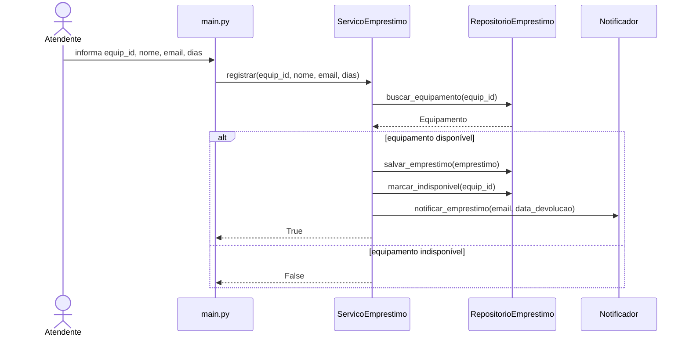
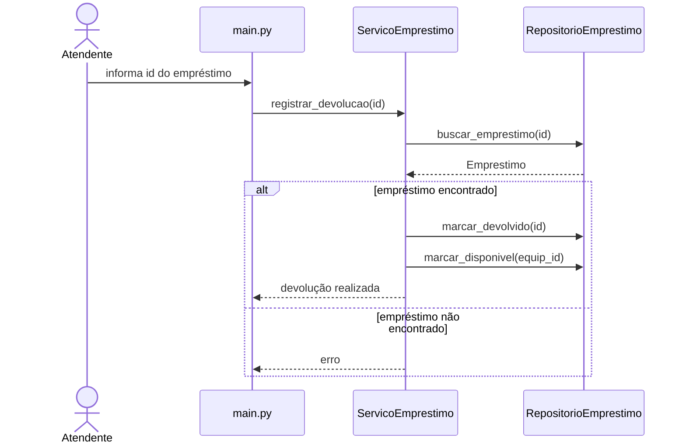
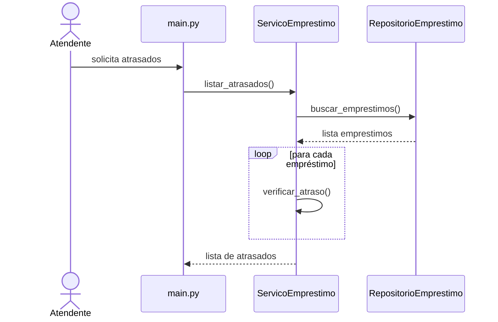

# Diagramas e Decomposição
A decomposição abaixo foi baseada na arquitetura definida no ADR-001 e nos princípios discutidos na resenha da Aula 3, como coesão, separação de responsabilidades e ocultamento de informação.
---

## Decomposição em camadas

### models/Equipamento
Responsável por representar os dados do equipamento de forma tipada.

### models/Emprestimo
Representa as informações de um empréstimo realizado no sistema.

### services/ServicoEmprestimo
Centraliza as regras de negócio relacionadas aos empréstimos.

### services/Notificador
Responsável pelo envio de notificações do sistema.

### repositories/RepositorioEmprestimo
Responsável pelo armazenamento e recuperação de dados.

### main.py
Controla a interação principal do sistema com o usuário.

---

# Diagramas de sequência

## UC01 — Registrar Empréstimo

---

## UC02 — Registrar Devolução

---

## UC03 — Listar Empréstimos em Atraso

